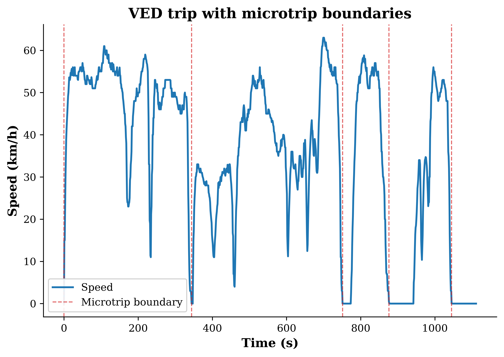

# drivecycle-stats

Tools to describe driving trips from per-second speed data, and to compare two sets of trips with a formal statistical test.

## Install

```bash
pip install -e .
```

## A ten-line example

```python
from drivecycle_stats.io_ved import load_ved_dynamic_csv, iter_ved_trips, clean_trip
from drivecycle_stats.descriptors import trip_descriptors

raw = load_ved_dynamic_csv("VED_171101_week.csv")
veh_id, trip_id, raw_trip = next(iter_ved_trips(raw))
frame, report = clean_trip(raw_trip)

print(trip_descriptors(frame))
```

## Figure



*A real VED trip, split into microtrips at each stop. See `examples/01_load_and_segment.ipynb`.*

## What is included

- Splitting a trip into microtrips (the part between one stop and the next).
- Standard trip numbers: average speed, running speed, idle share, number of stops, and more. Each number has a written definition, because different papers use slightly different ones.
- Vehicle-specific power, a common way to estimate engine load from speed and acceleration.
- Energy distance: a statistical distance between two samples that is sensitive to the whole shape of the data, not just the average.
- TOST: a formal way to test whether two samples are close enough to call equivalent, not just "not significantly different."
- A tool to flag unusual trips using density estimation.
- Figures in a fixed style, ready for a paper.

## Scope and limits

This package covers descriptive analysis and two-sample comparison of driving data that already exists. It does not generate driving cycles. If you are looking for a tool that creates synthetic driving cycles, this is not it.

Road grade is assumed zero throughout. VSP values on graded roads will be biased.

## Methods and citations

See `docs/methods.md` for a full write-up. Short version:

- Vehicle-specific power: Jimenez-Palacios (1999), PhD thesis, MIT.
- Energy distance: Szekely and Rizzo (2013), *Journal of Statistical Planning and Inference*.
- TOST: Schuirmann (1987), *Journal of Pharmacokinetics and Biopharmaceutics*.
- Example data: Oh, LeBlanc, Peng (2020), Vehicle Energy Dataset (VED), *IEEE Transactions on Intelligent Transportation Systems*. Repository: https://github.com/gsoh/VED. VED is licensed Apache-2.0 by its authors; that licence covers the dataset itself and is separate from this package's own licence.

## Where this lives

The main repository is on Codeberg. A mirror is kept on GitHub. Both hold the
same code; open issues on Codeberg.

## Licence and how to cite

This package is MIT licensed, see `LICENSE`. To cite it, see `CITATION.cff`.

## Author

Shahab Mafi, [ORCID 0000-0003-1494-8655](https://orcid.org/0000-0003-1494-8655).
Contact details are in `CITATION.cff`.
